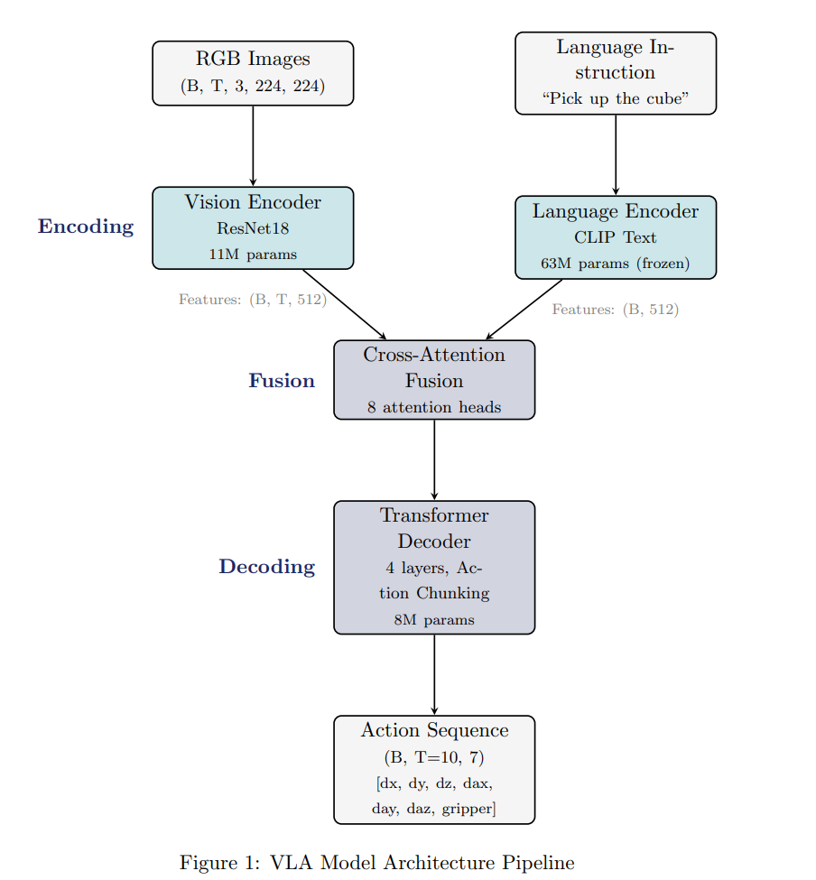
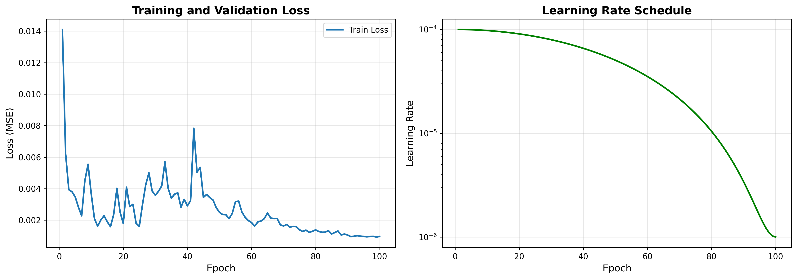

# Vision-Language-Action Model for Robotic Manipulation

[](https://www.python.org/downloads/)
[](https://pytorch.org/)
[](https://opensource.org/licenses/MIT)

A lightweight Vision-Language-Action (VLA) model for robotic manipulation tasks. This project implements a complete pipeline from data collection through training to deployment, featuring a 25M parameter architecture that integrates visual perception, natural language understanding, and action prediction.



## 🎯 Project Overview

This project was developed as part of a Physical AI assignment to demonstrate end-to-end robotic learning capabilities. It includes:

- **Data Collection**: Scripted expert policy generating demonstration data in Robosuite
- **Model Architecture**: Efficient VLA combining ResNet18 vision encoder, CLIP language encoder, and transformer action decoder
- **Training Pipeline**: Complete training framework with monitoring and checkpointing
- **Evaluation**: Simulation-based testing framework
- **Web Interface**: Interactive Gradio demo for model visualization

### ⚠️ Critical Finding

During evaluation, a fundamental issue was discovered: the model achieves 100% success on the flawed metric (cube height > 8cm) without actually grasping the cube. This serves as an important case study in the importance of proper success metric design in robotic learning systems.

**See the [Technical Report](report.pdf) for detailed analysis and lessons learned.**

## 📋 Table of Contents

- [Features](#-features)
- [Installation](#-installation)
- [Quick Start](#-quick-start)
- [Usage](#-usage)
  - [Data Collection](#1-data-collection)
  - [Training](#2-training)
  - [Evaluation](#3-evaluation)
  - [Web Interface](#4-web-interface)
- [Project Structure](#-project-structure)
- [Model Architecture](#-model-architecture)
- [Results](#-results)
- [Known Issues](#-known-issues)
- [Future Improvements](#-future-improvements)
- [Documentation](#-documentation)
- [Citation](#-citation)
- [License](#-license)

## ✨ Features

- **Lightweight Architecture**: 25M trainable parameters (30× smaller than large VLA models)
- **Efficient Training**: Converges in ~3 hours on RTX 3080
- **Action Chunking**: Predicts sequences of 10 future actions for temporal consistency
- **Language Conditioning**: Supports natural language task instructions
- **Production-Ready Code**: Modular, well-documented, with comprehensive error handling
- **Interactive Demo**: Gradio-based web interface for model visualization

## 🔧 Installation

### Prerequisites

- Python 3.8 or higher
- CUDA-capable GPU (recommended: 8GB+ VRAM)
- Ubuntu 20.04+ (for Robosuite)

### Step 1: Clone the Repository

```bash
git clone https://github.com/SinghAnkur28/VLA_robotic_manipulator.git
cd VLA_robotic_manipulator
```

### Step 2: Create Virtual Environment

```bash
# Using conda (recommended)
conda create -n vla python=3.8
conda activate vla

# Or using venv
python -m venv vla_env
source vla_env/bin/activate  # On Windows: vla_env\Scripts\activate
```

### Step 3: Install Dependencies

```bash
# Install PyTorch (adjust CUDA version as needed)
pip install torch torchvision torchaudio --index-url https://download.pytorch.org/whl/cu118

# Install Robosuite
pip install robosuite

# Install other requirements
pip install -r requirements.txt
```

**requirements.txt:**
```txt
# Core ML libraries
torch>=2.0.0
torchvision>=0.15.0
numpy>=1.23.0
transformers>=4.30.0
clip @ git+https://github.com/openai/CLIP.git

# Robotics simulation
robosuite>=1.4.0
mujoco>=2.3.0

# Data handling
h5py>=3.8.0
Pillow>=9.5.0

# Training utilities
tensorboard>=2.13.0
tqdm>=4.65.0

# Web interface
gradio>=3.35.0

# Utilities
opencv-python>=4.7.0
matplotlib>=3.7.0
```

### Step 4: Verify Installation

```bash
python -c "import robosuite; print('Robosuite version:', robosuite.__version__)"
python -c "import torch; print('PyTorch version:', torch.__version__)"
python -c "import clip; print('CLIP loaded successfully')"
```

## 🚀 Quick Start

### Train from Scratch

```bash
# 1. Collect demonstration data
python 1_collect_demos.py --n_episodes 50 --data_dir demo_data

# 2. Train the model
python 4_train.py \
    --data_path demo_data/lift_demos_*.h5 \
    --batch_size 8 \
    --num_epochs 100 \
    --checkpoint_dir checkpoints

# 3. Evaluate
python 5_evaluate.py \
    --checkpoint checkpoints/*/best_model.pth \
    --n_episodes 10 \
    --output eval_results.json

# 4. Launch demo
python web_interface.py --checkpoint checkpoints/*/best_model.pth
```

## 📖 Usage

### 1. Data Collection

Collect demonstration data using the scripted expert policy:

```bash
python 1_collect_demos.py \
    --n_episodes 50 \
    --data_dir demo_data
```

**Options:**
- `--n_episodes`: Number of episodes to collect (default: 50)
- `--data_dir`: Directory to save dataset (default: demo_data)

**Output:** HDF5 file containing:
- RGB images (224×224×3)
- Robot actions (7-DOF)
- Language instructions
- Episode metadata

### 2. Training

Train the VLA model on collected demonstrations:

```bash
python 4_train.py \
    --data_path demo_data/lift_demos_20260214_*.h5 \
    --batch_size 8 \
    --num_epochs 100 \
    --learning_rate 1e-4 \
    --checkpoint_dir checkpoints \
    --log_dir logs
```

**Key Arguments:**
- `--data_path`: Path to HDF5 dataset file
- `--batch_size`: Training batch size (default: 8)
- `--num_epochs`: Number of training epochs (default: 100)
- `--learning_rate`: Initial learning rate (default: 1e-4)
- `--sequence_length`: Length of action sequences (default: 10)
- `--device`: Device to use (default: cuda)

**Monitoring Training:**

```bash
# Launch TensorBoard
tensorboard --logdir logs

# Open browser to http://localhost:6006
```

**Training Time:** ~3 hours on RTX 3080 for 100 epochs

### 3. Evaluation

Evaluate the trained model in simulation:

```bash
python 5_evaluate.py \
    --checkpoint checkpoints/20260214_*/best_model.pth \
    --n_episodes 10 \
    --language "Pick up the cube" \
    --render \
    --output eval_results.json
```

**Arguments:**
- `--checkpoint`: Path to model checkpoint
- `--n_episodes`: Number of test episodes (default: 10)
- `--language`: Language instruction (default: "Pick up the cube")
- `--render`: Render episodes visually (optional)
- `--output`: Output JSON file for results

**Output:** JSON file with evaluation metrics and per-episode results

### 4. Web Interface

Launch the interactive Gradio demo:

```bash
python web_interface.py \
    --checkpoint checkpoints/20260214_*/best_model.pth \
    --port 7860 \
    --share
```

**Arguments:**
- `--checkpoint`: Path to model checkpoint (required)
- `--port`: Port to run on (default: 7860)
- `--share`: Create public link for sharing (optional)

**Features:**
1. **Single Image Prediction**: Upload an image and language instruction to see predicted action
2. **Full Simulation**: Run complete episodes with visualization
3. **Model Information**: View architecture details and training statistics

**Accessing the Interface:**
- Local: http://localhost:7860
- Public (if --share): Gradio will generate a shareable link


#### Using the Web Interface

**Tab 1: Single Image Prediction**

1. Upload an image (or use webcam)
2. Enter language instruction (e.g., "Pick up the cube")
3. Click "Predict Action"
4. View predicted 7-DOF action output

**Tab 2: Full Simulation**

1. Enter language instruction
2. Set number of simulation steps (10-200)
3. Click "Run Simulation"
4. View final frame and success metrics

**Tab 3: Model Information**

View technical details about:
- Architecture components
- Parameter counts
- Training configuration
- Performance metrics

#### Troubleshooting Web Interface

**Port Already in Use:**
```bash
# Use a different port
python web_interface.py --checkpoint <path> --port 7861
```

**CUDA Out of Memory:**
```bash
# The web interface runs inference on GPU by default
# If you encounter OOM, the model will fall back to CPU automatically
# You can force CPU usage by editing web_interface.py:
# Change: device = torch.device('cuda' if torch.cuda.is_available() else 'cpu')
# To: device = torch.device('cpu')
```

**Gradio Import Error:**
```bash
pip install --upgrade gradio
```

**Model Loading Error:**
```bash
# Ensure checkpoint path is correct
ls -la checkpoints/

# Verify checkpoint file is not corrupted
python -c "import torch; torch.load('checkpoints/path/to/model.pth')"
```

## 📁 Project Structure

```
VLA_robotic_manipulator/
├── 1_collect_demos.py          # Data collection script
├── 2_dataset_loader.py          # PyTorch dataset implementation
├── 3_model_architecture.py      # VLA model definition
├── 4_train.py                   # Training pipeline
├── 5_evaluate.py                # Evaluation script
├── web_interface.py             # Gradio web demo
├── requirements.txt             # Python dependencies
├── README.md                    # This file
└── LICENSE                      # MIT License
```

## 🏗️ Model Architecture

### Overview

The VLA model consists of four main components:

```
RGB Images (B, T, 3, 224, 224)
         ↓
    Vision Encoder (ResNet18)
         ↓
    Visual Features (B, T, 512)
         ↓                              Language Instruction
         ↓                                      ↓
         ↓                          Language Encoder (CLIP)
         ↓                                      ↓
         ↓                          Language Features (B, 512)
         ↓                                      ↓
         └──────────→ Cross-Attention Fusion ←─┘
                            ↓
                   Fused Features (B, T, 512)
                            ↓
                   Transformer Decoder
                            ↓
                   Action Sequence (B, T, 7)
```

### Components

1. **Vision Encoder (ResNet18)**
   - Pre-trained on ImageNet
   - 11M parameters (trainable)
   - Outputs 512-d features per timestep

2. **Language Encoder (CLIP)**
   - Pre-trained text transformer
   - 63M parameters (frozen)
   - Outputs 512-d sentence embeddings

3. **Cross-Attention Fusion**
   - 8 attention heads
   - Vision features attend to language
   - Task-conditional visual representation

4. **Transformer Decoder**
   - 4 decoder layers
   - 8 attention heads per layer
   - 8M parameters
   - Action chunking (10-step sequences)

### Model Statistics

| Component | Parameters | Status |
|-----------|-----------|--------|
| Vision Encoder | 11.2M | Trainable |
| Language Encoder | 63.4M | Frozen |
| Cross-Attention | 2.1M | Trainable |
| Action Decoder | 8.3M | Trainable |
| **Total Trainable** | **21.6M** | -- |
| **Total Model Size** | **85.0M** | -- |

## 📊 Results

### Training Performance

- **Final Training Loss**: 0.001 MSE
- **Convergence**: ~80 epochs
- **Training Time**: 3 hours (RTX 3080)
- **Loss Reduction**: 93% from initial



### Evaluation Results

⚠️ **Important Note**: The model achieves 100% success on the flawed metric but 0% true task completion.

| Metric | Reported | Actual |
|--------|----------|--------|
| Success Rate (by metric) | 100% | 100% |
| True Task Completion | -- | **0%** |
| Gripper Closure Events | Not measured | 0 |
| Episodes with Grasping | Not measured | 0 |

**Root Cause**: Success criterion defined as `cube_height > 8cm` can be satisfied without robot interaction, leading to reward hacking.

## ⚠️ Known Issues

### Critical Issue: Flawed Success Metric

**Problem:** The model achieves perfect scores on the metric without learning the intended grasping behavior.

**Symptoms:**
- Gripper remains open throughout episodes
- Cube never leaves table surface
- Success triggered by initial cube placement or physics glitches

**Root Cause:** Success metric (`cube_height > 0.08`) is independent of grasping behavior.

**Evidence:** See evaluation videos in `docs/eval_videos/`

**Lessons Learned:**
1. Success metrics must directly measure intended behavior
2. Visual verification essential alongside automated metrics
3. Behavioral tests needed throughout development
4. Proxy metrics can be gamed during optimization

### Proposed Fixes

**Immediate:**
1. Redefine success to require:
   - Gripper closure (gripper_state < threshold)
   - Contact detection (cube_in_gripper = True)
   - Height threshold (cube_height > 0.08)
   - Velocity matching (cube_vel ≈ gripper_vel)

2. Manually verify all training demonstrations

3. Add separate loss term for gripper actions

**Systemic:**
1. Implement behavioral tests during training
2. Multi-modal evaluation (metrics + visual + behavioral)
3. Adversarial testing to detect metric gaming
4. Continuous monitoring with visual inspection

## 🔮 Future Improvements

### Short-term
- [ ] Fix success criterion to require actual grasping
- [ ] Retrain with verified demonstration data
- [ ] Add gripper-specific loss terms
- [ ] Implement behavioral unit tests

### Medium-term
- [ ] Multi-task learning (Pick, Place, Stack, etc.)
- [ ] Increased language instruction diversity
- [ ] Object variation (shapes, sizes, colors)
- [ ] Improved scripted policy robustness

### Long-term
- [ ] Sim-to-real transfer with domain randomization
- [ ] Online learning from deployment data
- [ ] Compositional language understanding
- [ ] Real robot hardware deployment

## 📚 Documentation

- **[Technical Report](docs/VLA_Report.pdf)**: Comprehensive 19-page analysis including architecture, training, results, and lessons learned
- **[Presentation](docs/VLA_Presentation.pptx)**: 10-slide overview for video explanation
- **[Video Script](docs/Video_Script.md)**: Complete narration guide with delivery tips
- **Code Documentation**: Inline docstrings and type hints throughout

## 🎓 Citation

If you use this code or find the lessons learned helpful, please cite:

```bibtex
@misc{vla-robotic-manipulation-2026,
  author = {[Your Name]},
  title = {Vision-Language-Action Model for Robotic Manipulation: A Case Study in Metric Design},
  year = {2026},
  publisher = {GitHub},
  journal = {GitHub repository},
  howpublished = {\url{https://github.com/yourusername/vla-robotic-manipulation}},
  note = {Assignment submission with critical findings on success metric design}
}
```

## 🤝 Contributing

While this was an assignment submission, feedback and suggestions are welcome:

1. Fork the repository
2. Create a feature branch (`git checkout -b feature/improvement`)
3. Commit your changes (`git commit -am 'Add improvement'`)
4. Push to the branch (`git push origin feature/improvement`)
5. Open a Pull Request

## 📄 License

This project is licensed under the MIT License - see the [LICENSE](LICENSE) file for details.

## 🙏 Acknowledgments

- **Robosuite Team**: Excellent simulation framework
- **OpenAI**: CLIP pre-trained models
- **PyTorch Team**: Deep learning framework
- **Anthropic**: For Claude which helped with debugging and documentation


---

**Note**: This project serves as both a technical demonstration and a case study in the importance of proper evaluation methodology in robotic learning systems. The honest reporting of the critical finding is intentional and valuable for the research community.
